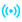

<div align="center">

#  Matrix Watcher

### A rigorously honest monitor for hidden correlations across independent real-world systems

[](https://matrixwatcher.space)
[](LICENSE)
[](https://www.python.org)
[](https://matrixwatcher.space)
[](#no-ai-pure-statistics)

**[Live dashboard → matrixwatcher.space](https://matrixwatcher.space)**

*We watch. We measure. We tell the truth — even when the truth is "nothing here."*

</div>

---

## What is Matrix Watcher?

Matrix Watcher watches **9 completely independent real-world data streams** at once — from Bitcoin to earthquakes to hardware quantum noise — and asks a single, honest question:

> **Do anomalies in unrelated domains line up more often than pure chance would produce?**

It is a **measurement instrument, not a fortune teller.** It does not promise to predict markets or earthquakes. It records what happens, tests it against chance with methods designed to *disprove* any apparent pattern, and publishes the result transparently — including the unglamorous but valuable answer: *no significant signal so far.*

That honesty is the point. Most "correlation" projects fool themselves (or you). Matrix Watcher is built to be impossible to fool — by itself or anyone else.

---

## The 9 data sources

Every source is a **real, public data feed** — no simulations, no fabricated numbers.

| # | Source | What it tracks | Feed |
|---|--------|----------------|------|
|  | **Crypto** | BTC/ETH price moves & volatility | Binance |
|  | **Blockchain** | Network block times & on-chain anomalies | public RPC |
|  | **Quantum RNG** | Hardware quantum randomness | ANU QRNG |
|  | **Space Weather** | Geomagnetic Kp index, solar wind | NOAA SWPC |
|  | **Solar Activity** | F10.7 flux, GOES X-ray flares, proton flux | NOAA |
|  | **Earthquakes** | Global seismicity (magnitude, location) | USGS |
|  | **Volcanoes** | Weekly volcanic activity report | Smithsonian / USGS |
|  | **Weather** | Temperature & pressure swings | Open-Meteo |
|  | **News** | Global headline volume | public RSS |

---

## How it works

```
9 live sensors → adaptive anomaly detection (each stream's own floating "normal")
              → self-learning  predict → verify → score  loop  →  honest live dashboard + activity feed
```

1. **Sensing** — each source is polled in real time and stored as raw JSONL.
2. **Adaptive anomaly detection** — no fixed thresholds. A reading is flagged only when it is unusual *relative to that stream's own recent distribution* (robust statistics, floating thresholds); the bar drifts with each stream's regime. Real physical events (a quake, a geomagnetic storm, an M-class flare) are flagged at their established physical levels. Emitted **once on the rising edge** — a single ongoing event is never double-counted.
3. **Clustering** — when anomalies from several *independent* sources land in the same 30-second window, that is a cluster. The level (1–5) is simply *how many distinct domains coincided* — a temporal coincidence, never a claim of causation.
4. **Self-learning predict → verify → score** — for every condition the system learns `P(event│condition)`, shows a prediction **only when it beats the event's base rate** (`skill = P(event│condition) − P(event)`) with enough evidence, then **verifies** each prediction against what actually happened and keeps an honest running score. Patterns that stop working stop being shown — the loop keeps re-learning. Any domain can predict any other.

| Level | Meaning |
|-------|---------|
| **L1** | single source (background) |
| **L2** | two domains coincide |
| **L3** | three domains — *Multiple Correlation* |
| **L4** | four domains — *Strong Correlation* |
| **L5** | five or more — *Critical Synchronicity* (rarest) |

---

## How we avoid fooling ourselves

This is the heart of the project. Apparent patterns are stress-tested with methods built to **disprove** them:

- **Edge-triggering** — one ongoing event counts once, not once per poll (kills duplication artifacts).
- **Shuffle test** — observed clusters are compared against time-randomized data (circular and schedule-aware nulls).
- **Out-of-sample backtest + block bootstrap** — is any predictive skill statistically real, or noise?
- **Base-rate comparison** — a 90% probability that merely matches the 90% base rate is *not* a finding.

The full analysis toolkit (`replay`, `shuffle_test`, `backtest`) lives in [`src/analyzers/offline/`](src/analyzers/offline/).

---

## Honest finding (as of June 2026)

Across months of clean, de-duplicated data covering all 9 domains:

> **No cross-domain predictive edge has held up out of sample.** The only relationships that survive testing live *within a single domain* (storm persistence, earthquake aftershocks) — known physics, not hidden links between unrelated worlds.

The rebuilt adaptive system now accumulates forward evidence continuously, so the honest verdict on cross-domain links is **"not proven — still gathering data,"** not a final "no." If a genuine signal ever appears, the same strict tests will surface it **credibly** — not by accident or wishful thinking.

---

## No AI. Pure statistics.

Matrix Watcher intentionally uses **no artificial intelligence, neural networks, or language models** in its analysis. Every number is transparent and reproducible:

```
probability = occurrences / observations
skill       = P(event│condition) − P(event)
```

Validated with shuffle tests and bootstrap. No black boxes. No hallucinations. Just data.

---

## Tech stack

- **Python 3.11+** — async sensor scheduler, event bus, adaptive anomaly detector
- **FastAPI** — real-time API + PWA backend
- **Vanilla JS PWA** — installable dashboard, offline-capable
- **JSONL** storage — simple, append-only, auditable
- **systemd** — 24/7 operation with auto-restart + watchdog

## Project structure

```
src/
├── sensors/            # 9 independent data collectors
├── core/               # event bus, scheduler, types
├── analyzers/
│   ├── online/         # adaptive detector, cluster detector,
│   │                   #   anomaly index, pattern tracker, digest
│   └── offline/        # replay, shuffle test, backtest (the rigor)
├── monitoring/         # health, alerting, calibration
└── storage/            # JSONL storage manager
web/                    # FastAPI API + PWA dashboard
```

## Run it yourself

```bash
git clone https://github.com/amois3/matrixwatcher.space.git
cd matrixwatcher.space
python -m venv venv && source venv/bin/activate
pip install -r requirements.txt
cp config.example.json config.json     # all sources work key-free out of the box
python main.py                          # start the collector
python run_pwa.py                       # start the dashboard (http://localhost:5555)
```

---

## Get involved

Matrix Watcher is open source because the right people make it better. It may be useful to you if you work in:

- **Data science / statistics** — rigorous null-result methodology, multi-stream correlation testing
- **Geophysics & space weather** — open, timestamped cross-domain observation data
- **Quantitative research** — a clean, honest framework for testing "is this signal real?"
- **Anyone** who values measurement over hype

If this resonates — for collaboration, research, or a serious conversation — open an issue or reach out.

**Author:** Aleksejs Moisejevs

---

## 📄 License

[MIT](LICENSE) © Aleksejs Moisejevs

<div align="center">
<sub>Built to watch honestly. <a href="https://matrixwatcher.space">matrixwatcher.space</a></sub>
</div>
